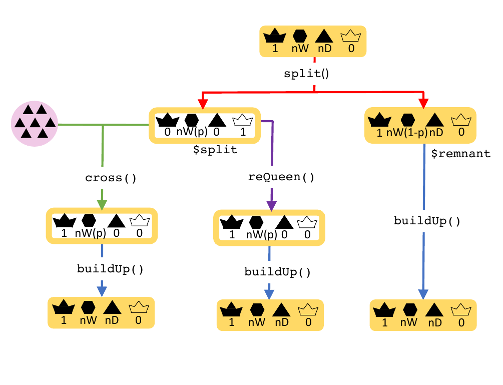

```{r setup, include = FALSE}
knitr::opts_chunk$set(
  collapse = TRUE,
  comment = "#>",
  include = TRUE
)
```

# Introduction

This vignette will introduce you to honeybee colony events. SIMplyBee implements
the most important natural events like swarming, supersedure, and collapse of
the colony, and a beekeeping management practice called splitting. All functions
that implement colony events work both on `Colony` and `MultiColony` objects.

First, we start by loading the package.

```{r}
library(package = "SIMplyBee")
```

The code below generates 6 colonies so we can demonstrate various colony events.

```{r create founder genomes and a Colony and Multicolony objects}
founderGenomes <- quickHaplo(nInd = 30, nChr = 1, segSites = 100)
SP <- SimParamBee$new(founderGenomes)
basePop <- createVirginQueens(founderGenomes)
drones <- createDrones(basePop[1:10], n = 1000)
fatherGroups <- pullDroneGroupsFromDCA(drones, n = 30, nDrones = 10)

# Create Colony and MultiColony class, cross them and build them up
colony <- createColony(x = basePop[11])
colony <- cross(colony, drones = fatherGroups[[1]])
colony <- buildUp(colony, nWorkers = 100, nDrones = 20)

apiary <- createMultiColony(basePop[12:17])
apiary <- cross(apiary, drones = fatherGroups[2:7])
apiary <- buildUp(apiary, nWorkers = 100, nDrones = 20, exact = TRUE)
```

# Swarming

Swarming is the process through which honeybee colonies produce new colonies.
When a honeybee colony outgrows its hive, becomes too congested, or too
populated for the queen's pheromones to spread among workers, then the swarming
begins. The workers start building swarm cells for new virgin queens. When the
queen is ready, she leaves the hive and is followed by about 70% of the workers
in a massive cloud of flying bees, the swarm (Rangel and Seeley, 2012). The
swarm will cluster on a nearby tree or bush and remain there until they find a
suitable new home.

The virgin queens developing in the old hive are daughters of the queen that
swarmed and are attended by the remnant workers that did not leave with the
swarm. After few days, the new virgin queens begin to emerge. Typically, the
first queen to emerge will kill the rest of virgin queens to assume the role as
the new queen for the colony. She will then go on a mating flight to find drones
to mate with to begin laying eggs and rebuilding the workforce in the colony
(Clemson Cooperative Extension, 2021; Rangel and Seeley, 2012).

In SIMplyBee, function `swarm()` simulates swarming (Figure 1). The function
takes a `Colony` class object and a percentage `p` of workers that leave with
the swarm. The function returns a list with two `Colony` class objects, `swarm`
and `remnant`. The `swarm` contains the old queen and `p` percentage of workers
that left the hive. The `remnant` contains the rest of workers `(1-p)`, all the
drones, and virgin queens that are daughters of the old queen that swarmed.

```{r swarm_figure, echo=FALSE, out.width='100%', fig.cap="Swarm function."}
knitr::include_graphics("../vignettes/swarm.png")
```

-   Swarming a Colony

Let's swarm our `colony`:

```{r swarm colony }
tmp <- swarm(colony, p = 0.4)
tmp
```

We see that the remnant colony does not have a queen but has one virgin queen
that will have to be mated. It also has 60 workers since we set `p` argument to
0.4, meaning that 40% of workers left with the swarm. All the drones remained in
the remnant. Note that the `swarm` status is turned to `TRUE`.

The swarm contains the old queen, no virgin queens, and 40 workers, since we set
the proportion `p` to 0.4. Same as in the remnant, the `swarm` status is turned
to `TRUE` in the swarm.

Swarming also turns the `production` slot to `FALSE` for both, the swarm and the
remnant colony, since we would not be able to collect honey from such colonies
(or other products).

The swarm stays genetically identical to the "old" colony, although downsized.
Assuming that we have caught the swarm, we assign it back to the original colony
object. The remnant has a new queen and is hence genetically different from the
original colony. Thus, we assigned it to a new colony object.

```{r saving output of the function}
colony <- tmp$swarm
colony1 <- tmp$remnant
```

After swarming, the colony would usually build-up back to the full size and the
virgin queens would mate. Building-up a colony turns the production status back
to `TRUE`.

```{r}
colony <- buildUp(colony)
colony
```

Instead of setting the `p` every time we call the `swarm()` function, we can
save the `swarmP` argument in the `SimParamBee` object. The `swarm()` function
will then use this percentage if `p` is not set.

```{r inspect the p swarm parameter in SP object}
SP$swarmP
```

The default value is 0.5, but we can set any value we want.

```{r set our own swarmP in SP object}
SP$swarmP <- 0.35
SP$swarmP
```

You can also use a non-fixed `p` parameter by using the function `swarmPUnif`
that samples the `p` from a uniform distribution between values 0.4 and 0.6
irrespective of the colony strength. You can read more about this in the
Sampling functions vignette.

-   Swarming a MultiColony

We swarm a `MultiColony` object in the same was we swarm a single `Colony` -
with the `swarm()` function. The `swarm()` function is here applied to each
colony in the `MultiColony` object with the same parameters. The function now
returns a list with two `MultiColony` objects - one containing the swarms and
the other containing the remnants.

```{r swarming MultyColony}
tmp <- swarm(apiary)
tmp
```

We see that we get six swarms and six remnants from the apiary with six
colonies. We can inspect individuals colonies to ensure they swarmed according
to the parameters. Let's inspect the swarm and remnant of the third colony.

```{r inspect the output (swarm)}
tmp$swarm[[3]]
```

```{r inspect the output (remnant)}
tmp$remnant[[3]]
```

We see that the the third colony was swarmed with `p` of 35% as specified in the
`SimParamBee`, hence the swarm left with 35 workers and the old queen, and the
remnant stayed behind with a new virgin queen and 65 workers.

Above, all the colonies in a `MultiColony` are swarmed with the same percentage.
However, we can also specify a different `p` for each colony.

```{r swarmed MultyColony object with different swarm p}
tmp <- swarm(apiary, p = c(0.3, 0.4, 0.5, 0.6, 0.7, 0.8))
```

If we now inspect the first and the second swarm, we see that each colony has a
different percentage of workers that stayed or left.

```{r}
tmp$swarm[[1]]
```

```{r}
tmp$swarm[[3]]
```

If you want to track the genetics, you might want to assign the swarms back to
the original apiary and create a new apiary from the remnants. However, if you
want to track the position, the remnant actually stay in the original position
and would hence be assigned back to the same apiary, while the swarm would be
assigned to a new apiary or even be lost. Here, we will track the genetics and
assign the swarm back to the original apiary and remnants to a new apiary.

```{r assign swarm back to apiary and build up the apiary}
apiary <- tmp$swarm
apiary <- buildUp(apiary)
apiary1 <- tmp$remnant
```

# Split

Colony splitting is a common beekeeping technique to limit swarming. A
percentage of workers, brood, and food stores are split away to create a new
colony or combine two split. Old queen normally stays in the original (remnant)
colony. We created a function `split()` that works on `Colony` and `Multicolony`
objects (Figure 2). It accepts the `p` argument as a proportion of workers that
will be split away for a new colony. The output of the function is a list of two
`Colony` or `MultiColony` objects: remnant that contains the old queen, drones,
and `(1-p)` workers; and split that doesn't contain a queen, but contains virgin
queens and `p` workers. The `split()` function follows the same principles as
the `swarm()`, hence we will limit explaining the outputs.

```{r split_figure, echo=FALSE, out.width='80%', fig.cap = "Split function"}

```

-   Splitting a Colony

```{r split a colony}
tmp <- split(colony, p = 0.3)
tmp
```

We see that remnant contains the old queen and 70% of workers since we set `p`
argument to 0.3, meaning that 30% of workers are removed in the split. The
`split` status of the remnant colony is turned to `TRUE`. The `production`
status of the remnant stays `TRUE`, because in reality we always split a colony
in a way that does not threaten the production of the remnant colony.

If we inspect the split, we see that it contains 30% of the workers, the `split`
status is turned to `TRUE`, and the `production` status is turned to `FALSE`,
since in reality, these small colonies would not be productive.

We would usually consider the remnant as the original colony, since it tracks
its genetics and location.

```{r}
colony <- tmp$remnant
colony
```

After a split, the colony would build-up back to their full-size.

```{r build up the colony}
colony <- buildUp(colony)
```

The `p` argument for splitting can be also saved in `SP` object, so we do not
specify it each time we call the function - see `SimParamBee$splitP`.

-   Splitting a MultiColony

We split a `MultiColony` object in the same way we split a `Colony` (as shown in
swarm).

```{r split the MultiColony object and inspect the first colony in remnant}
tmp <- split(apiary, p = 0.3)
tmp$remnant[[1]]
```

We again see that in remnant we have the queen and 70 workers:

```{r inspect the split of the first colony}
tmp$split[[1]]
```

and a virgin queen with 30 workers in split. We can use the vector of `p`,
different for each colony same as shown for the `swarm()` function above.

After the split, we would assign the remnant colonies back to the apiary and
build them up.

```{r build up the colony and apaiary for further examples}
apiary <- tmp$remnant
apiary <- buildUp(apiary)
```

# Supersedure

Supersedure is a replacement of the queen by one of her daughters without
interference of the beekeeper. Supersedure is a natural way of re-queening a
colony without swarming. There are many reasons for supersedure: poor physical
condition of a queen, old age, diseases, depleted spermatheca, poorly bread
queen, reduced pheromone output and many others (Hamdan, 2010).

Function `supersede()` removes the old queen and triggers the creation of new
virgin queens from the brood (Figure 3). The function returns a single `Colony`
or `MultiColony` object (not a list of two).

```{r supersede_figure, echo=FALSE, out.width='50%', fig.cap = "Supersede function"}
knitr::include_graphics("../vignettes/supersede.png")
```

-   Superseding a Colony

```{r supersede Colony object}
colony <- supersede(colony)
colony
```

We see that after a supersedure, the old queen is removed and a new virgin queen
is ready to mate. Hence, the next step in the simulation would be to cross this
virgin queen. We also see that the `supersedure` status is set to `TRUE`. The
`production` status stays set to `TRUE`, since the colony did not loose any
individuals (it stayed at it's full-size).

-   Superseding a MultiColony

The function `supersede()` works both on `Colony` and `MultiColony` classes. We
supersede a `MultiColony` in a same way as a `Colony`.

```{r supersede Multicolony object}
apiary <- supersede(apiary)
apiary
```

# Collapse

Collapse of the colony is a term that describes the death of a colony - when all
individuals within a colony die. There are many reasons for the collapse of a
honey bee colony: diseases, starvation, queen problems, contamination with
pesticides, etc. Colony losses can be high, possibly up to 60% of colonies per
year. High colony losses can significantly influence genetic structure of a
population and hence genetic diversity and genetic gain.

Function `collapse()` simulates the collapse of a colony (Figure 4). This
function does not remove individuals from the colony, but sets the `collapse`
status of the colony to `TRUE` and `production` status to `FALSE`. This is to
mimic reality, where bees would still be present in the colony, although being
dead. This allows us to extract any genetic material from the colony even after
collapse, say to study genetic causes related to the collapse. Future operations
in terms of reproduction or simulation of events are not allowed with a
collapsed colony.

```{r collapse_figure, echo=FALSE, out.width='50%', fig.cap = "Collapse function"}
knitr::include_graphics("../vignettes/collapse.png")
```

-   Collapsing a Colony

```{r collapse the colony}
colony <- collapse(colony)
colony
```

-   Collapsing a MultiColony

`collapse()` function is used when you want to keep collapsed colonies for
subsequent analyses. If you don't need the collapsed colony, you can also simply
select the surviving colonies with the `selectColonies()` function.

```{r collapse the MultiColony}
apiary <- collapse(apiary)
apiary[[3]]
apiary
```

# References

Clemson Cooperative Extension (2021) Frequently asked questions about honey bee
swarms.
<https://hgic.clemson.edu/factsheet/frequently-asked-questions-about-honey-bee-swarms>
(accessed on 2022-11-11)

Hamdan K. (2010) Natural Supersedure of Queens in Honey Bee Colonies. Bee World,
87(3):52-54. <https://doi.org/10.1080/0005772X.2010.11417360>

Rangel J., Seeley T. D. (2012) Colony fissioning in honey bees: size and
significance of the swarm fraction. Insectes sociaux, 59(4):453-462.
<https://doi.org/10.1007/s00040-012-0239-5>
