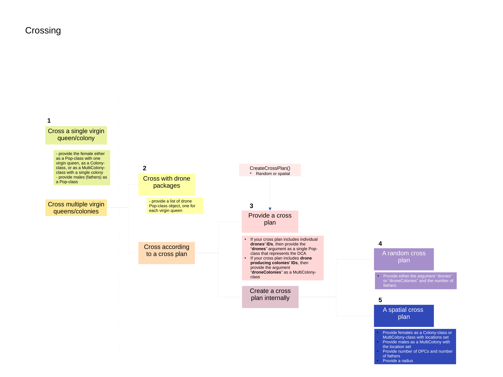

```{r setup, include = FALSE}
knitr::opts_chunk$set(
  collapse = TRUE,
  comment = "#>",
  include = TRUE
)
```

# Introduction

Crossing the queen is the most complicated action in SIMplyBee, since mating of
honeybees is versatile. Virgin queens can be mated in a controlled manner,
either using artificial insemination or a mating station, or uncontrolled in an
open mating setting. In the latter case, the mating depends on the distance
between the virgin queens and the drones or drone producing colonies.

In this vignette, we first explain five ways of mating virgin queens and at the
end we describe two special cases of mating virgin queens on a mating station
and mating multiple virgin queens in different ways.

```{r crossing_decision_tree, echo=FALSE, out.width='90%', fig.cap = "Crossing decision tree"}

```

To facilitate the understanding of the crossing function and choosing the
correct option for your need, we created a diagram with a decision tree
following the questions:

1.  How many virgin queens/colonies are you mating?

-   **one virgin queen** (Pop-class with one individual) or one virgin colony
    (Colony-class or MultiColony-class with a single colony). This is marked as
    **option 1** on the diagram. For this, you need to provide the females as
    either `Pop`, `Colony`, `MultiColony` class and males as a single `Pop`
    class object.
-   **multiple virgin queens** (Pop-class with multiple individuals) or multiple
    virgin colonies (MultiColony-class with multiple colonies). Continue to
    question 2.

2.  If you are mating **multiple virgin queens/colonies**, do you want to:

-   cross with **drone packages**, that is pre-prepared populations of drones
    for each queen? You probably want to use this if you want more control over
    the drones that mate with each queen, such as in artificial insemination.
    This crossing option is suitable when mating a smaller number of virgin
    queens since it is computationally not the most efficient. For this option,
    you need to provide the females as either `Pop`, `Colony`, `MultiColony`
    class and males as a list of `Pop` class object - one for each virgin
    queen/colony.
-   cross **according to a cross plan**. This option is the recommended option
    when mating a larger number of virgin queens/colonies. Continue to question
    3.  

3.  When mating **according to a cross plan**, you can either:

-   **provide a cross plan**, which is a list where the list names are either
    virgin queens' or virgin colonies IDs and the content for each virgin
    queen/colony is either
    -   the IDs drones she will mate with; in this case, you also have to
        provide `drones` argument as a single `Pop` class that represents the
        DCA with all the drones;
    -   the IDs of the drone producing colonies that she will mate with; in this
        case, you also have to provide the `droneColonies` argument as a
        `MultiColony` class with all drone producing colonies. You probably want
        to use this option when you are simulating an existing pedigree or
        trying to have more control over mating for a larger number of queens,
        such as on a mating stations. You can also use an auxiliary function
        `createCrossPlan()` to create the cross plan, but in this case, you
        probably want to move to question 4.
-   **create the cross plan internally**, either by sampling the drones or drone
    producing colonies randomly or spatially. Continue to question 4.

4.  When mating **according to an internally created cross plan**, you can
    either:

-   cross according to a **random cross plan**, where the mates for mating are
    sampled randomly. For this, you need to provide the females as either `Pop`,
    `Colony`, `MultiColony` class and males either through the `drones` argument
    as a `Pop` class object, or through the `droneColonies` argument as a
    `MultiColony` class object. You probably want to use this option if you are
    not concerned with spatial simulation or are simulation a small area with a
    single DCA. You can also use this option to mate virgin queens on a mating
    station in combination with the `createMatingStationsDCA()` function.
-   cross according to a **spatial cross plan**, where the mates for mating are
    sampled according to their geographic location in a set radius. For this,
    you need to provide both females and males as `MultiColony` objects with
    **the location set**, hence males have to be provided through the
    `droneColonies` argument. You probably want to use this option when
    simulating realistic breeding programs and populations.

Start by loading the package:

```{r}
library(package = "SIMplyBee")
library(package = "ggplot2")
```

First, we create a founder population and some virgin queen and virgin colonies
for crossing. We will also create four `MultiColony` objects that will represent
colonies from four different beekeepers.

```{r}
# Simulate 40 founder genomes
founderGenomes <- quickHaplo(nInd = 60, nChr = 1, segSites = 100)
# Set global population paramaters
SP <- SimParamBee$new(founderGenomes)
# Create a base population of 40 virgin queens
basePop <- createVirginQueens(founderGenomes)

# Prepare populations with a single virgin queen
virginQueen1 <- basePop[1]
# Prepare populations with multiple virgin queens
virginQueens1 <- basePop[2:4]
# Prepare virgin MultiColony objects
beekeeper1 <- createMultiColony(basePop[6:11])
beekeeper2 <- createMultiColony(basePop[12:16])
beekeeper3 <- createMultiColony(basePop[17:21])
beekeeper4 <- createMultiColony(basePop[22:31])
beekeeper5 <- createMultiColony(basePop[32:40])
beekeeper6 <- createMultiColony(basePop[41:50]) 
beekeeper7 <- createMultiColony(basePop[51:60]) 
```

We will now create a groups of drones from the remaining queens with 1,000
drones per queen that will represent a drone congregation area (DCA).

```{r}
# Create a DCA from the remaining virgin queens
DCA <- createDrones(basePop[42:50], nInd = 1000)
```

# Option 1: Cross a single virgin queen/colony

We start by crossing a single virgin queen that can be provided either in a
`Pop`, `Colony`, or `MultiColony` objects. In this case, you just need to
provide a `Pop` of drones she will mate with. Note that no sampling is applied
to the drones! Hence, if you provide a `Pop` with 100 drones, she will be mated
to 100 drones!

```{r}
# Samples some drone for mating from the DCA
drones <- selectInd(DCA, nInd = 10, use = "rand")
# Mate the virgin queen with the drones
queen1 <- cross(x = virginQueen1, drones = drones, checkCross = "warning")
# Check the number of fathers for the queen
nFathers(queen1)
```

The above code shows an example for mating the virgin queen in a `Pop` object,
but exact same holds for `Colony` and `MultiColony` objects with a single queen.

# Option2: Cross with drone packages (pre-selecting drone populations)

We continue by crossing our virgin females to drone packages, that is a
pre-selected populations of drones. We recommend this option when mating a
larger number of queens, although it could be used for mating a single virgin
queen/colony as well, and when you want more control over the drone selection.
We pre-select the groups by pulling a desired number of drone packages from a
DCA with the function `pullDroneGroupsFromDCA()`. This function requires you to
specify a group of drones (`DCA`), how many groups you want to pull from the DCA
(`n`), and how many drones per group you want (`nDrones`). For `nDrones`, you
can either specify an integer or a sampling function, which results in a
different number of drones in each of the pulled groups (you can read more about
this in the Sampling functions vignette). These sampling functions are
particularly useful in crossing simulations:

-   `nFathersPoisson()`: samples the number of drones from a Poisson
    distribution with a default mean of 15 (the user can specify a different
    mean) - the output can contain the value 0 and
-   `nFathersTruncPoisson()`: samples the number of drones from a zero truncated
    Poisson distribution with a default mean of 15 (the user can specif a
    different mean) - the output does not contain the value 0.

If these functions do not satisfy your needs, you can specify your own sampling
function(s).

We can pull the drone groups out separately for each crossing or pull them out
all at once.

```{r}
# Pre-select drone (father) populations from a DCA
droneGroups <- pullDroneGroupsFromDCA(DCA, n = 20, nDrones = nFathersTruncPoisson)
```

There is a different number of drones in each group because we used a sampling
function:

```{r}
sapply(droneGroups, FUN = nInd)
```

Now, we can cross our virgin queens to drone groups.

```{r}
# Pop-class with multiple queens
queens1 <- cross(x = virginQueens1, drones = droneGroups[1:3], checkCross = "warning")
nFathers(queens1)
```

```{r}
# MultiColony-class
beekeeper1 <- cross(x = beekeeper1, drones = droneGroups[4:9], checkCross = "warning")
nFathers(beekeeper1)
```

# Option 3: Cross according to a provided cross plan

When mating a large number of queens, creating drone populations can be
computationally demanding! A better option is to cross according to a cross plan
that includes all the females and the males that they will mate with, and males
as a single object. The cross plan is a list whose names are the IDs of either
the virgin queens or the colonies you want to cross (but not both in the same
cross plan!), and the content for each queen is either the IDs of drone or drone
producing colonies she will mate with (again, use either only drone or only
drone producing colony's IDs in one cross plan!). When providing drone IDs, you
also have to provide the males through the `drones` argument as a single `Pop`
class that represents the DCA with all the drones. The DCA can represent a DCA
of randomly assembled drones in the vicinity, a 'global' DCA of all drones
available at a time, or a DCA at a mating station. If you are providing drone
producing colonies' IDs, you need to provide the males through the
`droneColonies` argument as a single `MultiColony` class. Mating with drone
producing colonies might be computationally more efficient since only the drones
needed for mating are created on the spot.

You can use the cross plan either to gain more control over mating and create
the cross plan in a manual manner, or to simply reduce the computational burden
when mating a large number of virgin queens. For that, you can either use the
function `createCrossPlan()`, if you want to inspect the cross plan before
deployment, or simply let the `cross()` function to create the cross plan
internally (see options 5 and 6). The latter is just a shortcut since it calls
the `createCrossPlan()` function from within the `cross()`. Both option hence
allow to create the cross plan by randomly sampling available drones or drone
producing queens, or sample them according to their geographical proximity to
the virgin colony. Do note that to perform spatial sampling, the females and
males have to be provided and `MultiColony` objects with a set location. Another
situation where you would want to use the cross plan is when you want.

NOTE: You can create one cross plan for a number of virgin queens or colonies
and then mate each one separately. Let's say you have 100 colonies from two
beekeepers. You can create a cross plan for all of them in one go, and then mate
colonies from each beekeeper separately by providing the same cross plan. Do
note again, that one cross plan can either contain only virgin queen or only
virgin colonies' IDs, no mix and and match!

Let us now create a random cross plan with drone IDs to mate the virgin colonies
from one of the beekeepers.

```{r}
crossPlan1 <- createCrossPlan(x = beekeeper2,
                              drones = DCA,
                              nDrones = nFathersPoisson)
# Inspect the cross plan
crossPlan1
sapply(crossPlan1, length)
```

We see that the cross plan is a list, with names being colony IDs and elements
of the list being the ID of drones that each virgin colony will mate with. Now,
we can cross the colonies of each beekeeper by providing the `crossPlan1` to the
`cross()` function and the created DCA through the `drones` argument.

```{r}
# Cross the colonies of the beekeeper 2
beekeeper2 <- cross(x = beekeeper2, drones = DCA, crossPlan = crossPlan1, checkCross = "warning")
nFathers(beekeeper2)
```

Now, let us now create a spatial cross plan, this time by sampling drone
producing colonies that will provide drones to mate with another one of our
virgin apiaries. We will mate colonies of beekeeper 3. In this examples,
colonies from beekeeper 1 and beekeeper 2 will serve as drone producing
colonies. Although we are not sampling drones directly, you still need to
provide `nDrones` argument to determine the number of sampled drone producing
colonies.

For spatial mating, we need to set the location to our apiaries (all the
colonies within an beekeeper will have the same location). Here, we are setting
this locations randomly, but these could be actual coordinated of colonies
within a country.

```{r}
# Set location to apiaries
beekeeper1 <-  setLocation(beekeeper1, 
                           location = Map(c, runif(nColonies(beekeeper1), 0, 2*pi), runif(nColonies(beekeeper1), 0, 2*pi)))
beekeeper2 <-  setLocation(beekeeper2, 
                           location = Map(c, runif(nColonies(beekeeper2), 0, 2*pi), runif(nColonies(beekeeper2), 0, 2*pi)))
beekeeper3 <-  setLocation(beekeeper3, 
                           location = Map(c, runif(nColonies(beekeeper2), 0, 2*pi), runif(nColonies(beekeeper3), 0, 2*pi)))

```

We can plot the location of colonies to see how they arrange in space. Again, we
want to mate the virgin queens of beekeeper 3 with drone produced by colonies of
beekeepers 1 and 2.

```{r}
locationsDF <- data.frame(Location = getLocation(c(beekeeper1, beekeeper2, beekeeper3), collapse = TRUE),
                          Beekeeper = c(rep("Beekeeper1", nColonies(beekeeper1)),
                                        rep("Beekeeper2", nColonies(beekeeper2)),
                                        rep("Beekeeper3", nColonies(beekeeper3))))

ggplot(data = locationsDF, aes(x = Location.1, y = Location.2, colour = Beekeeper)) + 
  geom_point()
```

Next, we create a spatial cross plan for mating our colonies. We set the radius
to however far we believe our drone can fly according to the scale of locations
coordinates. All the drones within that area then have the same probability of
mating with the queen, which follows the believe that drones aggregate in a DCA.

```{r}
crossPlan2 <- createCrossPlan(x = beekeeper3,
                              droneColonies = c(beekeeper1, beekeeper2),
                              spatial = TRUE,
                              radius = 3,
                              nDrones = 13)
# Inspect the cross plan
crossPlan2
sapply(crossPlan2, length)
```

We see that there is a different number of drone producing queen for each virgin
queen in the specified radius . It could also happen, there are no drone
producing colonies in that radius. In that case, you can either increase the
radius, if you think that is sensible, or some virgin queens will remain
unmated. Once we have the spatial cross plan, we can mate our colonies.

```{r}
beekeeper3 <- cross(x = beekeeper3, 
                    crossPlan = crossPlan2,
                    droneColonies = c(beekeeper1, beekeeper2),
                    nDrones = 13,
                    checkCross = "warning")
# Inspect the number of fathers
nFathers(beekeeper3)
```

As you see, we have duplicated quite some information in running first a
function that creates a cross plan and then performing the crossing. If you are
not really keen on inspecting the cross plan before mating, we suggest you use
the options 4 and 5 (see below).

You may also want to provide an existing cross plan if you want to create more
tailored cross plans and cross virgin queens with different methods (i.e. you
want to mate one queen in the apiary in an artificial insemination, some of them
would be open mated etc.). For that, see the section "Special cases" at the end
of this vignette.

# Options 4 and 5: Cross according to an internally created cross plan

The procedure behind this option is exactly the same as described in option 4
with using `createCrossPlan()` function to create either a random and spatial
cross plan and then crossing according to the plan. The difference is that in
this option, the two steps are combined within the `cross()` function.

Let us mate the colonies of the remaining beekeepers 4 and 5 with colonies of
beekeepers 1 to 3 as drone producing colonies. Let's first set the locations of
the beekeepers 4 and 5 colonies.

```{r}
beekeeper4 <-  setLocation(beekeeper4, 
                           location = Map(c, runif(nColonies(beekeeper4), 0, 2*pi), runif(nColonies(beekeeper4), 0, 2*pi)))
beekeeper5 <-  setLocation(beekeeper5, 
                           location = Map(c, runif(nColonies(beekeeper5), 0, 2*pi), runif(nColonies(beekeeper5), 0, 2*pi)))
```

Now, we will mate the colonies of beekeeper 4 in a random manner and colonies of
beekeeper 5 in a spatial manner, all within the `cross()` function. For this,
you have to pass a keyword "create" to the `crossPlan` argument in the
`cross()`.

```{r}
beekeeper4 <- cross(x = beekeeper4,
                    droneColonies = c(beekeeper1, beekeeper2, beekeeper3),
                    crossPlan = "create",
                    spatial = FALSE,
                    nDrones = 12,
                    checkCross = "warning")
nFathers(beekeeper4)

beekeeper5 <- cross(x = beekeeper5,
                    droneColonies = c(beekeeper1, beekeeper2, beekeeper3),
                    crossPlan = "create",
                    spatial = TRUE,
                    radius = 3,
                    nDrones = 12,
                    checkCross = "warning")
nFathers(beekeeper5)
```

# Special cases

## Cross virgin queens at a mating station

Mating virgin queens at a mating station is no different than mating them at an
open DCA - the difference is in the DCA itself. In the case of open mating, the
DCA consists of drones from multiple queens, all of which are usually unknown.
In the case of a mating station, the DCA consists of drones coming from a sister
group of drone producing queens (DPQ), the queen of which is known. This allows
us to track the pedigree on the paternal side.

To simulate this, you can either: \* create a group of sister queens and provide
them to the `cross()` function through the `droneColonies` argument; \* create a
mating stations DCA and then either pull drone packages from it, create a random
plan from it, or provide it directly to the `cross()` function through the
`drones` argument.

Here, we will demonstrate one of the options. We will create a mating station
DCA using `createMatingStationDCA()` function, which takes a single "sire"
colony (queen of the DPQs). From the "sire" colony, the function first produces
a desired number of sister DPQs, and next produces a desired number of drones
per DPQ. The produced drones represent the mating station's DCA.

```{r}
# Create a DCA at a mating station from colony1
(matingStationDCA <- createMatingStationDCA(beekeeper1[[3]], nDPQs = 20, nDronePerDPQ = 1000))
```

We see that the output of the function is a single population of 20,000 drones
that represents the DCA. As mentioned, once you have the DCA, you can use it in
different manners. Here, we will feed it directly to the `cross()` function and
assume random sampling of drones. Spatial sampling does not make sense here,
since all the drones and the virgin colonies are at the same location - the
mating station.

```{r}
# Mate only an beekeeper
beekeeper6 <- cross(beekeeper6,
                    drones = matingStationDCA,
                    spatial = FALSE,
                    crossPlan = "create",
                    nDrones = 15,
                    checkCross = "warning")
nFathers(beekeeper6)
```

## Cross colonies with varying methods

It could happen that you have some virgin colonies in an apiary and you want to
inseminate one of the virgin queens artificially with a single drone, take three
of them to a mating station, and mate the rest of them openly at a local DCA.
Since the cross plan is a named list, you can concatenate multiple cross plans
into one. Let's mate the multicolony of beekeeper 4 in such a manner.

```{r}
# Create a single drone for single drone insemination
singleDrone = createDrones(beekeeper1[[1]], nInd = 1)
# Create a cross plan for crossing some of the colonies in an open DCA, 
# some with single drone, and some on a mating station
crossPlanBeekeeper7 <- c(
  createCrossPlan(x = beekeeper7[1], 
                  drones = singleDrone, 
                  nDrones = 1),
  createCrossPlan(x = beekeeper7[2:6], 
                  drones = DCA, 
                  nDrones = nFathersTruncPoisson),
  createCrossPlan(x = beekeeper7[7:10], 
                  drones = matingStationDCA, 
                  nDrones = nFathersTruncPoisson)
  )

beekeeper7 <- cross(x = beekeeper7, 
                    crossPlan = crossPlanBeekeeper7, 
                    drones = c(singleDrone, DCA, matingStationDCA),
                    checkCross = "warning")
nFathers(beekeeper7)
```
