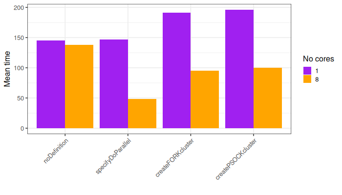
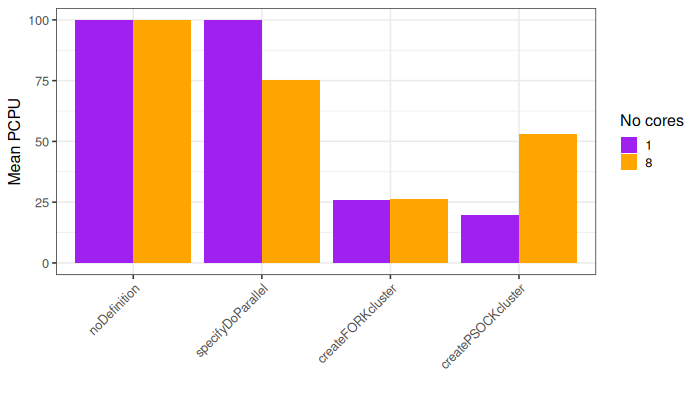
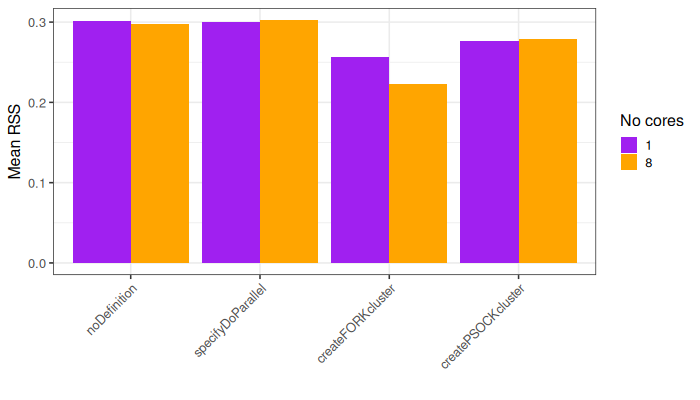
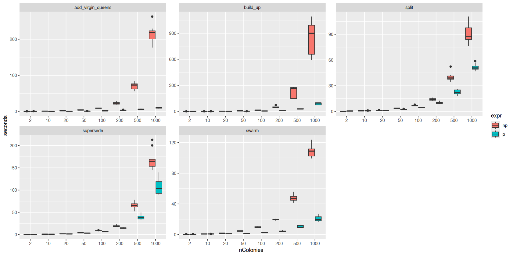

```{r setup, include = FALSE}
knitr::opts_chunk$set(
  collapse = TRUE,
  comment = "#>",
  include = TRUE
)
```

# Quick set-up instructions

Here, we show how you should set-up the parallel back-end on different
environments. We do recommend reading the remaining of this vignette. We
recommend running these lines straight after setting the `SimParamBee`.

```{r quick_setup, eval=F, echo=T}
library(SIMplyBee)
library(parallel)
library(doParallel)

founderGenomes <- quickHaplo(nInd = 30, nChr = 1, segSites = 100)
SP <- SimParamBee$new(founderGenomes)
SP$nThreads <- NCORES #Where NCORES is a specified number or all available cores (detectCores(), see below)

# If using Linux/MACOS
registerDoParallel(cores = SP$nThreads)

# If using Windows machine / running the simulation on HPC
cl <- makeCluster(SP$nThreads, type="PSOCK")
registerDoParallel(cl)
#Do the simulation 
# At the end of everything you run
stopImplicitCluster()
```

# Introduction

Honeybee simulations consist of simulating individuals as `Pop` classes, and
then on top of this also `Colony` and `MultiColony` classes, all of them with
their meta-data. This makes the simulation computationally demanding and slow.
With the aim to speed up the simulation, we parallelised the major functions
with `foreach` and `doParallel` R packages. Nothing changed in terms of running
the functions, but do functions now have the ability to run on multiple cores at
the same time. They would all search for the number of available cores in the
`SimParamBee` object, under `nThreads`. You can set that to a desired number or
make the simulation use all available cores.

```{r nThread_setup}
library(package = "SIMplyBee")
library(package = "parallel")

founderGenomes <- quickHaplo(nInd = 30, nChr = 1, segSites = 100)
SP <- SimParamBee$new(founderGenomes)

# Set the number of cores to use
SP$nThreads <- 8
# Or use all available cores
SP$nThreads <- detectCores()
```

In R, there are two possible options for parallelisation, `FORK` and `PSOCK`.
The forking (`FORK`) creates subprocesses that share memory and objects with the
parent process, which means it's very efficient! However, such parallelisation
is not supported on Windows machines and is not allowed on most high-performing
clusters!

The alternative, PSOCK, can be used on all system, but it works by creating a
separate R process for each subprocess (that communicate through sockets),
meaning that the whole environment needs to be copied to each subprocess,
creating a larger memory overhead. (adapted from
<https://cran.r-project.org/web/packages/abn/vignettes/multiprocessing.html>).

We profiled the following piece of code using different parallelisation options.

```{r defining_testing_function}
create_bee_colonies <- function() {
  founderGenomes <- quickHaplo(nInd = 200, nChr = 1, segSites = 50)
  SP <- SimParamBee$new(founderGenomes)
  
  basePop <- createVirginQueens(founderGenomes)
  drones = createDrones(basePop, nInd = 100)
  baseColonies <- createMultiColony(cross(basePop, drones = drones, crossPlan = "create"))
  baseColonies <- buildUp(baseColonies, nWorkers = 1000, nDrones = 1000)
  baseColonies <- supersede(baseColonies)
  baseColonies <- cross(baseColonies, drones = drones, crossPlan = "create")
  tmp = split(baseColonies)
}
```

We set up different parallelisation back-ends with the following code, where
`ncores` was either 1 or 8.

```{r parallelisation_options, eval=F, echo=T}

# First one - ???
SP$nThreads = ncores
registerDoParallel(cores = SP$nThreads)
create_bee_colonies()

# Second one - create a FORK cluster
SP$nThreads = ncores
cl <- makeCluster(SP$nThreads, type="FORK")
registerDoParallel(cl)
create_bee_colonies()
stopImplicitCluster()

# Third one - create a PSOCK cluster
SP$nThreads = ncores
cl <- makeCluster(SP$nThreads, type="PSOCK")
registerDoParallel(cl)
create_bee_colonies()
stopImplicitCluster()
```

Here are the results of running these different options. You can see that the
time can be significantly improved when running on multiple cores. When running
on a single core, setting up the parallelisation cluster via `FORK` or `PSOCK`
actually adds some overhead time.

```{r meanTime_figure, echo=FALSE, out.width='100%'}

```

```{r meanPCPU_figure, echo=FALSE, out.width='100%'}

```

```{r meanRSS_figure, echo=FALSE, out.width='100%'}

```

The functions that are currently explicitily parallelised:

-   L1: cross, pullCasteP, createCastePop

-   L2: supersede, split, swarm, setEvents, combine, setLocation, reQueen,
    addCastePop, removeCastePop, resetEvents, collapse

-   L3: createMultiColony

The following figure shows the benefit of parallelised (p, in blue) vs
sequential/non-parallelised functions (np, in red) when run on a Linux machine
with 16 cores. The figure shows the mean and the standard deviation across 10
replicates.

```{r functions_time, echo=FALSE, out.width='100%'}

```

